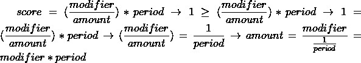

## What was done well?

**Requirements**
- **Credit scoring**: The credit scoring algorithm is implemented very beautifully inside the method highestValidLoanAmount (as proven below). Multiplying credit modifier with the loan period returns the maximum approved amount by essentially fixing the credit score to be exactly 1, i.e any higher amount would not be approved. However, it might not be clear at first and one might miss it when trying to verify system requirements or debug.   
- **Return maximum sum**: The decision engine returns the maximum approved sum correctly (which is exactly the modifier multiplied with the loan period). While the maximum approved sum is not displayed to the user, it was only specified what the decision engine should return and not what the user should see.
- **Find suitable period**: Engine finds the suitable period correctly. However, it found the suitable period by incrementing current loan period and checking if max approved sum was at least minimum allowed (2000). I simplified it to just minumum allowed divided by credit modifier, which is more efficient (O(1)) and does the same thing.
- **Frontend**: UI looks great and is functional. It did have one mistake that I will point out in the next section. 
## What can be done better?

- **Shortcoming**: The code could benefit from better use of Java’s inheritance. The way the intern did it makes the code less readable and maintainable. For instance, multiple exceptions in the decision engine could be generalized to a parent exception class. The intern created several identical exception classes, violating the DRY principle. This could be improved by creating a parent class, DecisionEngineException, for common functionality. This approach enhances readability, maintainability, and avoids repeating code.  
- **Frontend**: The loan period slider had the minimum value displayed as 6 months when as per the requirements the minimum loan period should be 12 months. The frontend frequently sent requests to the backend when the slider was moved, which affects performance, but compensates in user satisfaction.
- **Readability and Single Responsibility Principle**: Some of the methods were too large and doing too many things. I extracted bigger methods into smaller ones and made each method have a single functionality.
- **OOP**: In OOP it is better to pass the request as an object to other methods to make it more maintainable. For example, if we later want to add additional parameters to the request, we won't have to change tests or other methods too much. 
